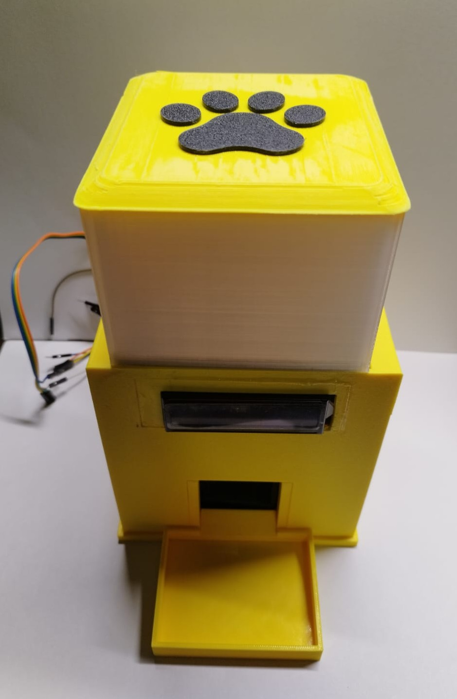
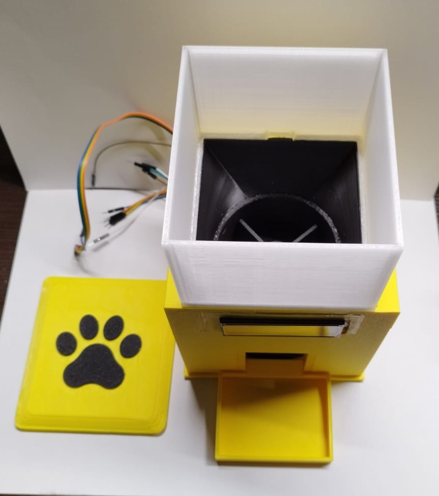

# 🐾 Comedero-Automatico-Mascotas (Verilog & FSM)

---

## 1. Descripción y Justificación del Proyecto

### Descripción
Este proyecto consiste en el diseño e implementación de un **comedero automático para mascotas** desarrollado en su totalidad en **Verilog HDL** para su despliegue en tarjetas FPGA. El sistema gestiona ciclos de alimentación programados, control de actuadores (servomotor o motor paso a paso) y comunicación serial sincrónica con periféricos mediante el protocolo **I2C**, todo procesado directamente a nivel de hardware lógico reconfigurable sin depender de un procesador embebido (*soft-core*) ni microcontroladores externos.

### Justificación
En la actualidad, muchas personas cuentan con una disponibilidad limitada de tiempo debido a compromisos laborales, académicos o personales, lo que puede dificultar la realización de ciertas actividades cotidianas que requieren horarios específicos. Esta situación puede afectar especialmente a los dueños de mascotas, ya que no siempre es posible alimentarlas en los momentos adecuados del día, lo que puede alterar sus hábitos de alimentación y afectar su bienestar.

Con el propósito de mitigar esta problemática, se diseñó e implementó un prototipo de comedero automático capaz de dispensar alimento de forma programada, permitiendo satisfacer las necesidades alimenticias de la mascota sin depender de la presencia constante de su dueño. El sistema fue desarrollado empleando una tarjeta de desarrollo Altera Cyclone IV como unidad de control y un motor de accionamiento encargado del mecanismo de dispensación, ambos gobernados mediante una rutina de funcionamiento definida por el usuario.

* **Fiabilidad Físicamente Robusta:** La arquitectura basada en Máquinas de Estado Finito (FSM) sintetizadas en bloques lógicos elimina riesgos de bloqueos de software o problemas de gestión de memoria.
* **Diseño Digital Puro:** Demuestra la integración de conceptos avanzados de lógica digital, tales como controladores I2C personalizados a nivel de bit, divisores de frecuencia hardware y máquinas de estado acopladas.

---

## 2. Módulos y Componentes del Proyecto

### Componentes de Hardware

| Componente | Modelo / Tipo | Función en el Sistema |
| :--- | :--- | :--- |
| **Tarjeta FPGA** | Altera Cyclone IV  | Procesamiento de la lógica RTL y generación de señales de control. |
| **Módulo RTC** | DS3231 (I2C) / Modulo de tiempo| Provee la hora en tiempo real o la masa de alimento en el plato vía I2C. |
| **Actuador** | Motor Paso a Paso 28BYJ-48 | Activación del mecanismo dispensador de alimento para mascota.|
| **Interfaz de Usuario** | Display 16x2 / Deep Switch | Configuración de raciones, estado de la FSM e indicadores de error o estado actual del dispositivo.|
| **Alimentación** | Fuente Regulada Externa (5V/12V) | Suministro independiente para los motores. |

## 3. Diagrama de Maquinas de Estado (FSM)

## 4. Resultados Obtenidos

* **Resultados Generales de la Implementación:** Se implementó apropiadamente la lógica digital para el control de sistemas electromecánicos, específicamente un comedero automático para perros de talla mediana. El diseño basado en Máquinas de Estados Finitos en Verilog demostró una precisión temporal y de control absoluta, garantizando que la activación del motor paso a paso coincida exactamente con las lecturas de tiempo del módulo RTC.
* **Consolidación Prototipo Funcional** Se logró manufacturar y concebir desde cero un prototipo físico que cumple con todos los requerimientos de diseño y funcionales correspondiente a un comedero de mascota. Con un diseño simple, estéticamente agradable y manufacturado por medio de impresión 3D.

### Prototipo Modelado/Realizado

